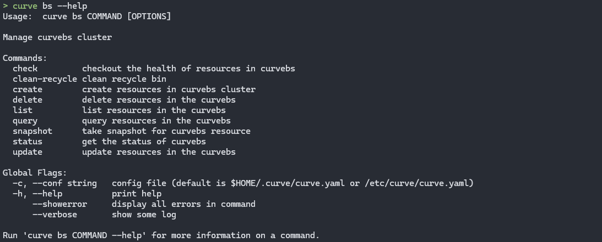
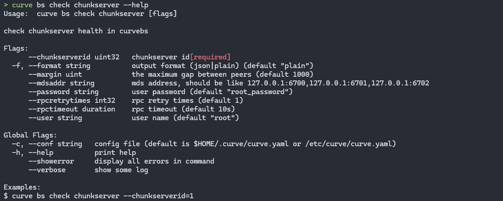
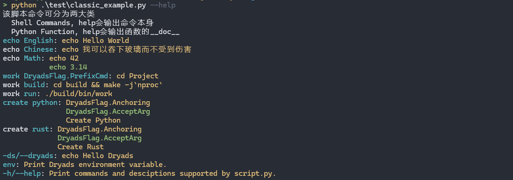

# Dryads
Simple CLI building tool and script management tool.

+ 对标：
  + Simple CLI building tools: argparse, click and typer
  + Script management tool: [Just](https://github.com/casey/just)


## 发心

在图形化（GUI）软件出现之前，计算机操作员使用的是命令行（CLI）软件。两种软件本质是将人的指令交给计算机。

学术的说，在CLI中，有argument参数，不带前缀，是字符串；flag标志，通常以`-`开头，通常是可选的，相当于bool值；options选项，通常以`-`或者`--`开头，通常后接参数。注意`git add`中的`add`并不属于此三者的任何一个，而是命令本身。

形象的说，命令、参数、标志和选项是人和计算机交流的语言。而围绕某一个事物的一系列修饰词中，将归纳汇总并依次连接，可形成树形结构，很多命令行工具的选项都是。

举个🌰，[网易的分布式存储系统](https://github.com/opencurve/curve)下有对集群的运维工具[curve-tool](https://github.com/opencurve/curve/tree/master/tools-v2)

  
有子命令，分别是`bs`（管理块存储集群）、`completion`()、`fs`（管理文件存储集群）、`upgrade`（升级）。

使用一个子命令继续看  
  
还有子命令，可以理解为针对块存储集群的各种操作，比如`check`（检测）、`create`（创建资源）、`delete`（删除资源）、`list`（罗列资源）等等。

继续使用一个子命令继续看
  
还有子命令，对于“检测”这个动作，还能继续“修饰”，到底检测什么“事物”

继续使用一个子命令继续看
  
至此确实没有了，开始添加flag了

可以想象，将这里所有的子命令取出来，并通过前后关系作为Parent结点和Child结点，可以形成树形结构。

再举个🌰，在完成[CMU 15445 Lab](https://15445.courses.cs.cmu.edu/)过程中，需要较多命令，比如测试、格式化、打包等等。而每个动作还能细分，比如Lab分成多个Project，每个Project又分成多个Task。于是就出现了“测试Project1 Task1相关代码”这样的命令。同理，格式化和打包操作也类似。所以可形成如下树形结构（以Json表示）
```json
{
    "test": {
        "p1": {
            "t1": ...,
            "t2": ...,
            ...
        },
        "p2": ...,
        ...
    },
    "format": ...,
    "submit": ...,
}
```

故本项目的使用场景呼之欲出

+ Simple CLI building tools: 如果命令行工具可以描述为嵌套的子命令，则该框架可以很简单的构建。
+ Script management tool: 如果围绕某个项目或者在工作流中有一系列的命令，可以用该框架管理使之维护在一个文件中。同时大量的命令几乎无法记忆（比如在15445中使用的命令），通过子命令的方式使记忆它们称为可能（子命令对应一个脚本）。同时，文件主体是一个Python文件，命令作为字符串嵌入其中，同样是脚本语言，Python有较于Bash或者Powershell强的多的表意能力和跨平台性。

该工具以嵌入我的工作流中并极大的提高我的效率。

## Install

+ 通过PyPI：[PyPI](https://pypi.org/project/dryads/)

    ```bash
    pip install dryads
    ```

    同时会下载命令`ds`，它会在当前路径递归向上寻找`dryadsfile`文件并使用Python解释器运行它。我们也建议每个项目下都有一个`dryadsfile`用来管理维护该项目需要命令，原因在[Just Further Ramblings](https://github.com/casey/just/tree/master?tab=readme-ov-file#further-ramblings)

## Use

+ 命令`ds`，如上，它会在当前路径递归向上寻找`dryadsfile`文件并使用Python解释器运行它。
+ 如果是在Linux系统，通过在脚本前添加shebang

    ```python
    #!/usr/bin/env python3
    # -*- coding: utf-8 -*-
    ```

    则可以通过`./script.py`这种很接近命令的形式使用

使用字符串表达脚本内容，而Python中“万物皆对象”，可以将函数本身作为值传递。使用`dict`数据类型即可描述出树形结构，将该`dict`交给框架，子命令的解析和执行交给框架即可。

下面是一个经典的例子。

```python
# test/classic_example.py
from dryads import Dryads, DryadsContainer, DryadsFlag, run_shell_cmd

def create_python():
    run_shell_cmd(f"poetry new {DryadsContainer.DryadsArg}")

def create_rust():
    run_shell_cmd(f"cargo new {DryadsContainer.DryadsArg}")

CMDS = {
    "echo": {
        "English": "echo Hello World",
        "Chinese": "echo 我可以吞下玻璃而不受到伤害",
        "Math": ["echo 42", "echo 3.14"],
    },
    "work": {
        DryadsFlag.PrefixCmd: ["cd Project"],
        "build": "cd build && make -j`nproc`",
        "run": "./build/bin/work",
    },
    "create": {
        "python": [
            DryadsFlag.Anchoring,
            DryadsFlag.AcceptArg,
            create_python,
        ],
        "rust": [
            DryadsFlag.Anchoring,
            DryadsFlag.AcceptArg,
            create_rust,
        ],
    },
    ("-d", "--dryads"): "echo Hello Dryads",
}

Dryads(CMDS)
```

直接执行上文件输出如下  


相当于  


其中子命令`env`和`-h`/`--help`是默认生成的

对于各级子命令，也能使用`-h`（或者`--help`）选项


下面聊聊语法

+ 以嵌套的`dict`数据结构描述树形结构
+ `dict`的键只能是`str`或者`tuple[str]`或者`DryadsFlag`（这是什么后面再聊）来描述子命令
+ 叶子节点以`str`/`Callable`/`list[str | Callable]`类型表示具体的要执行的脚本内容。

    + 每个`str`类型字面量作为一个Shell脚本一起交给Shell执行，即一个字符串可以是多行的，它们是连续的。
    
        + 如果在`list[str]`中有`cd`命令，列表中的其他字符串中的命令不会被影响。

+ 执行：一个命令的所有子命令相当于从根到叶子的路径
  
    + 叶子节点：  
      

    + 中间节点：执行该节点子树中的所有叶子节点  
      

+ 标记`DryadsFlag`，当希望概念某些默认的行为时，以标记的方式实现。其本身是枚举量，作为键或者叶子执行修改某种行为。

  + `DryadsFlag.Anchoring`: 作为叶子的值, 表示该叶子中的命令都是以执行脚本的路径开始, 默认从脚本所在的路径开始, 例子在[Anchoring](./test/flag_anchring.py)
  + `DryadsFlag.AcceptArg`: 作为叶子的值, 表示该选项还接收一个可选参数, 并将参数放在变量DryadsArg中, 例子在[AcceptArg](./test/flag_accept_arg_valid.py), 还有两个非法的例子, [AcceptArg Invalid](./test/flag_accept_arg_invalid_cmd.py) | [AcceptArg Invalid](./test/flag_accept_arg_invalid_func.py)
  + `DryadsFlag.InVisible`: 作为叶子的值, 表示执行的脚本是否打印, 默认打印, 使用该标志表示不打印, 例子在[InVisible](./test/flag_invisiable.py)
  + `DryadsFlag.IgnoreErr`: 作为叶子的值, 表示命令执行出错后是否停止, 默认停止, 使用该标志表示不停止, 例子在[IgnoreErr](./test/flag_ignore_err.py)
  + `DryadsFlag.PrefixCmd`: 作为某个节点的键, 其值对应的脚本为子树中所有脚本的前置脚本, 例子在[PrefixCmd](./test/flag_prefix_cmd.py)
    + 该标记只能用于`dict`不能用于`list`，但往往是对叶子节点`list`中的一系列命令设置前置脚本，可通过再套一层dict解决。

## 用户

+ [BusTub lab test script](https://github.com/zweix123/bustub_2023spring_backup/blob/master/script.py#L146): [介绍](https://github.com/zweix123/CS-notes/blob/master/README.md#CMU15445)
+ [Note Tool](https://github.com/zweix123/CS-notes/blob/master/dryadsfile#L292)
